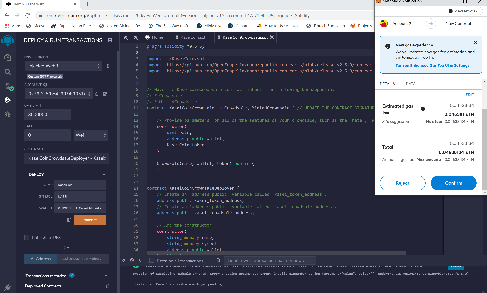
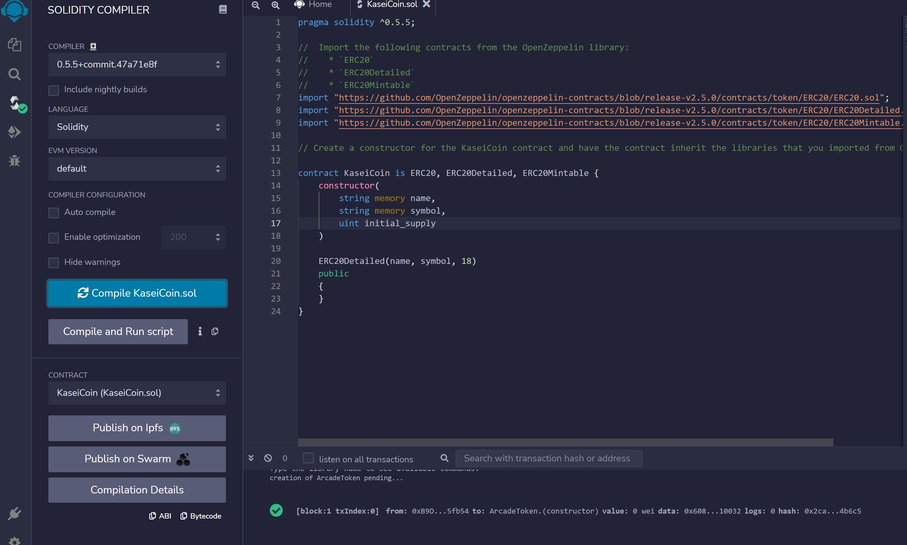
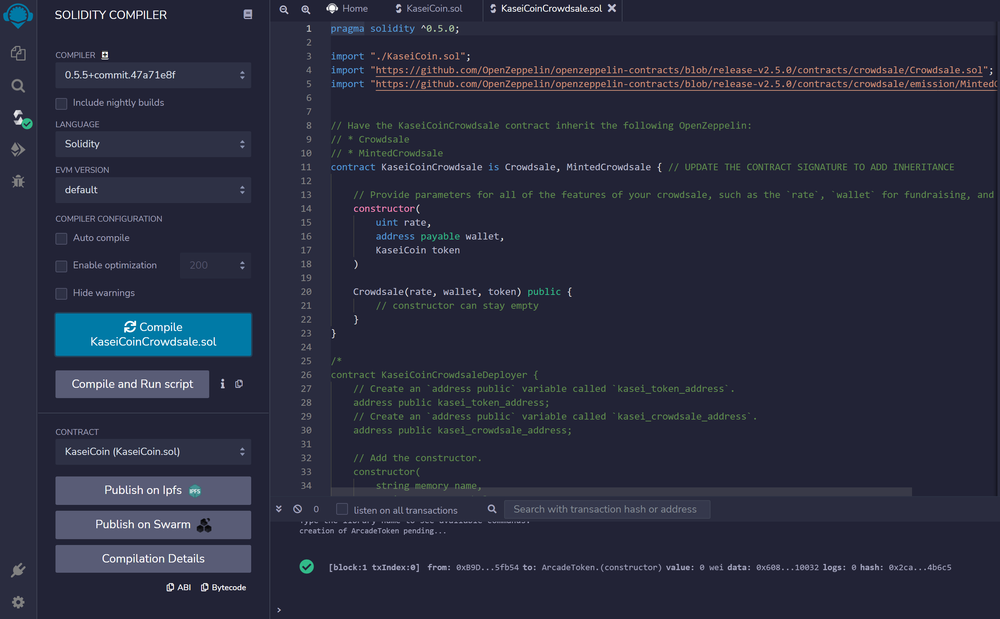
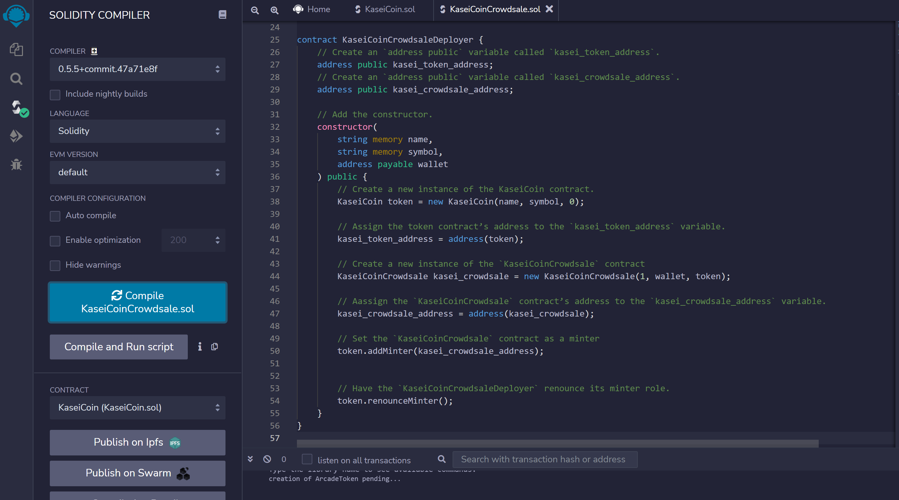

# Martian Token Crowdsale Challenge

The purpose of this challenge is to use Solidity to launch a crowdsale contract that will allow people who are moving to Mars to convert their earthling money to KaseiCoin. You will create a fungible token that is ERC-20 compliant and that will be minted by using a Crowdsale contract from the OpenZeppelin Solidity library.
    
---

## Technologies

This analysis leverages Solidity (pragma ^0.5.5) and utilizes Remix IDE, Metamask, and Ganache to build and test smart contracts.

---

## Installation Guide

Install the Metamask browser extension and Ganache before running this program.

---

## Usage
The challenge is hosted on the following GitHub repository at: https://github.com/nguyenthuyt/kasei_coin   

### **Run instructions:**
To run this project, simply clone the repository or download the files. Open a Remix IDE web browser instance and navigate to the directory that contains the follwing files:
**KaseiCoin.sol**
**KaseiCoinCrowdsale**

## Remix IDE Deployment
To compile and deploy the file using the following steps:

- Select the Injected Web3 environment
- From the Contract menu, select the KaseiCoinCrowdsaleDeployer
- Fill in the input fields for Name, Symbol, and Wallet and select Transact

- An instance of Metamask will appear

## Evaluation Evidence

Compiled KaseiCoin Token Contract

Compiled KaseiCoinCrowdsale Contract

Compiled KaseiCoinCrowdsaleDeployer Contract

---

## Contributors

This project was created as part of the Rice Fintech Bootcamp 2022 Program by:

Thuy Nguyen

Email: nguyen_thuyt@yahoo.com

LinkedIn: nguyenthuyt

---

## License

MIT

