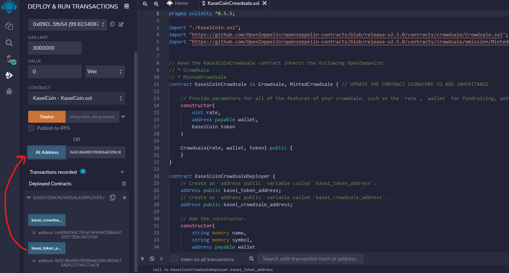

# Martian Token Crowdsale Challenge

The purpose of this challenge is to use Solidity to launch a crowdsale contract that will allow people who are moving to Mars to convert their earthling money to KaseiCoin. You will create a fungible token that is ERC-20 compliant and that will be minted by using a Crowdsale contract from the OpenZeppelin Solidity library.
    
---

## Technologies

This analysis leverages Solidity (pragma ^0.5.5) and utilizes Remix IDE, Metamask, and Ganache to build and test smart contracts.

---

## Installation Guide

Install the Metamask browser extension and Ganache before running this program.

---

## Usage
The challenge is hosted on the following GitHub repository at: https://github.com/nguyenthuyt/kasei_coin   

### **Run instructions:**
To run this project, simply clone the repository or download the files. Open a Remix IDE web browser instance and navigate to the directory that contains the following files:
**KaseiCoin.sol**
**KaseiCoinCrowdsale**

and deploy the following contract:
**KaseiCoincrowdsaleDeployer**

## Remix IDE Deployment
To compile and deploy the file using the following steps:

- Select the Injected Web3 environment
- From the Contract menu, select the KaseiCoinCrowdsaleDeployer
- Fill in the input fields for Name, Symbol, and Wallet and select Transact

- An instance of Metamask will appear asking to confirm the transaction. Click confirm to proceed.

- Link the KaseiCoin contract to the KaseiCoinCrowdsaleDeployer contract by copying the address from the 'kasei_token_address' variable and pasting it into the At Address text box. Click the 'At address' button to link the contract

- Repeat the same steps as above to link the KaseiCoinCrowdsale contract but using the 'kasei_crowdsale_address'

## Test Purchase of Tokens

- In the value input box, specify an amount to purchase. In this instance, we selected 5 wei.

- From the KaseiCoinCrowdsale contract, in the field next to 'Buy Tokens', insert a beneficiary (investor) address and click the 'Buy Tokens' button

- To verify, the transaction was processed, scroll down to 'balanceOf' and insert the beneficiary address and click the 'balanceOf' button. In this instance, the beneficiary account has increased to 5 KaseiCoin.

## View Total Supply of Minted Tokens & Wei Raised

- To view the total supply of minted tokens, navigate to the KaseiCoin contract and click on 'totalSupply'

- To view the total wei raised from the crowdsale, navigate to the KaseiCoinCrowdsale contract and click on 'weiRaised'

## Evaluation Evidence

Compiled KaseiCoin Token Contract

Compiled KaseiCoinCrowdsale Contract

Compiled KaseiCoinCrowdsaleDeployer Contract

---

## Contributors

This project was created as part of the Rice Fintech Bootcamp 2022 Program by:

Thuy Nguyen

Email: nguyen_thuyt@yahoo.com

LinkedIn: nguyenthuyt

---

## License

MIT

